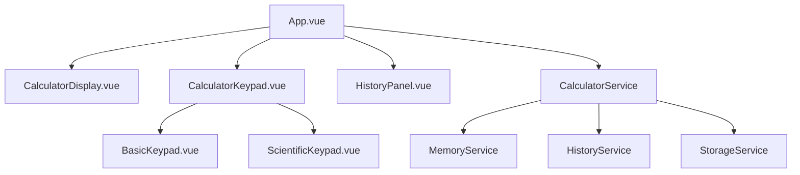

# Design Document

## Overview

Web Calculator 是一個基於 Vue 3 的現代化網頁計算器應用，提供基礎運算、科學計算、記憶功能和歷史記錄功能。應用採用組件化架構，將計算邏輯與 UI 分離，確保程式碼的可維護性和可測試性。整體設計遵循單一職責原則，每個組件和模組專注於特定功能，並透過清晰的介面進行通訊。

## Steering Document Alignment

### Technical Standards (tech.md)

* 採用 TDD 方式（紅綠燈）開發
* 使用 Vue 3 Composition API 開發，提供更好的類型支援和代碼組織
* 採用 TypeScript 確保類型安全
* 使用 Vite 作為構建工具，提供快速的開發體驗
* CSS 採用 Scoped Styles 避免樣式污染
* 遵循 Vue 官方風格指南和最佳實踐

### Project Structure (structure.md)

* 組件放置於 `src/components/` 目錄
* 業務邏輯和計算引擎放置於 `src/services/` 目錄
* 工具函數放置於 `src/utils/` 目錄
* 類型定義放置於 `src/types/` 目錄
* 測試檔案與源碼放置在相同目錄，使用 `.spec.ts` 後綴

## Code Reuse Analysis

### Existing Components to Leverage

此為新專案，目前無現有組件可重用。未來可考慮：

* 使用 Vue 生態系統中的狀態管理解決方案（如 Pinia）若應用複雜度增加
* 考慮使用成熟的數學計算庫（如 Math.js）以提高計算精度

### Integration Points

* **LocalStorage API**: 用於持久化歷史記錄和使用者偏好設定
* **Keyboard Events**: 整合瀏覽器鍵盤事件以支援鍵盤操作
* **CSS Media Queries**: 實現響應式設計，適配不同裝置尺寸

## Architecture

應用採用分層架構設計，包含以下層次：

1. **Presentation Layer（展示層）**: Vue 組件負責 UI 渲染和使用者互動
2. **Service Layer（服務層）**: 計算引擎、記憶管理、歷史記錄管理等業務邏輯
3. **Storage Layer（儲存層）**: LocalStorage 封裝，負責數據持久化

### Modular Design Principles

* **Single File Responsibility**: 每個組件檔案只負責一個 UI 區塊（如按鈕面板、顯示器）
* **Component Isolation**: 組件間透過 props 傳遞數據，透過 events 通知父組件，避免直接依賴
* **Service Layer Separation**: 計算邏輯完全獨立於 UI，可單獨測試和重用
* **Utility Modularity**: 工具函數（如格式化、驗證）獨立為小型模組



## Components and Interfaces

### App.vue

* **Purpose:** 根組件，管理全局狀態和組件間的通訊
* **Interfaces:**
  * 管理計算器當前狀態（顯示值、運算符、運算數）
  * 處理鍵盤事件
  * 協調各子組件的互動
* **Dependencies:** CalculatorService, MemoryService, HistoryService
* **Reuses:** N/A（根組件）

### CalculatorDisplay.vue

* **Purpose:** 顯示當前輸入和計算結果
* **Interfaces:**
  * Props: `displayValue: string`, `memoryIndicator: boolean`, `mode: 'deg' | 'rad'`
  * Events: 無（純展示組件）
* **Dependencies:** 無
* **Reuses:** 格式化工具函數

### CalculatorKeypad.vue

* **Purpose:** 管理按鈕面板的佈局和切換（基礎/科學模式）
* **Interfaces:**
  * Props: `mode: 'basic' | 'scientific'`
  * Events: `@button-click(value: string)`
* **Dependencies:** BasicKeypad, ScientificKeypad
* **Reuses:** 無

### BasicKeypad.vue

* **Purpose:** 基礎運算按鈕面板（數字、四則運算、清除）
* **Interfaces:**
  * Props: 無
  * Events: `@button-click(value: string)`
* **Dependencies:** 無
* **Reuses:** 無

### ScientificKeypad.vue

* **Purpose:** 科學計算按鈕面板（三角函數、對數、冪次方等）
* **Interfaces:**
  * Props: 無
  * Events: `@button-click(value: string)`
* **Dependencies:** 無
* **Reuses:** 無

### HistoryPanel.vue

* **Purpose:** 顯示和管理計算歷史記錄
* **Interfaces:**
  * Props: `history: HistoryItem[]`, `visible: boolean`
  * Events: `@select-history(item: HistoryItem)`, `@clear-history()`, `@close()`
* **Dependencies:** HistoryService
* **Reuses:** StorageService

### CalculatorService

* **Purpose:** 核心計算引擎，處理所有數學運算邏輯
* **Interfaces:**
  ```typescript
  class CalculatorService {
    calculate(operator: string, operand1: number, operand2: number): number
    scientificCalculate(func: string, value: number, mode?: 'deg' | 'rad'): number
    power(base: number, exponent: number): number
    validateInput(input: string): boolean
  }
  ```
* **Dependencies:** 無（純計算邏輯）
* **Reuses:** Math 標準庫

### MemoryService

* **Purpose:** 管理計算器記憶功能
* **Interfaces:**
  ```typescript
  class MemoryService {
    clear(): void
    recall(): number
    add(value: number): void
    subtract(value: number): void
    hasValue(): boolean
  }
  ```
* **Dependencies:** 無
* **Reuses:** 無

### HistoryService

* **Purpose:** 管理計算歷史記錄
* **Interfaces:**
  ```typescript
  class HistoryService {
    addHistory(expression: string, result: number): void
    getHistory(): HistoryItem[]
    clearHistory(): void
    loadHistory(): void
    saveHistory(): void
  }
  ```
* **Dependencies:** StorageService
* **Reuses:** StorageService

### StorageService

* **Purpose:** 封裝 LocalStorage 操作
* **Interfaces:**
  ```typescript
  class StorageService {
    setItem<T>(key: string, value: T): void
    getItem<T>(key: string): T | null
    removeItem(key: string): void
  }
  ```
* **Dependencies:** 無
* **Reuses:** LocalStorage API

## Data Models

### CalculatorState

```typescript
interface CalculatorState {
  displayValue: string;        // 當前顯示的值
  currentOperator: string | null;  // 當前運算符 (+, -, *, /, ^)
  previousOperand: number | null;  // 前一個運算數
  waitingForOperand: boolean;  // 是否等待輸入新運算數
  mode: 'deg' | 'rad';        // 角度/弧度模式
  error: string | null;       // 錯誤訊息
}
```

### HistoryItem

```typescript
interface HistoryItem {
  id: string;                 // 唯一識別碼 (timestamp)
  expression: string;         // 計算式 (例如: "2 + 3")
  result: number;            // 計算結果
  timestamp: number;         // 時間戳記
}
```

### MemoryState

```typescript
interface MemoryState {
  value: number;             // 記憶體中儲存的值
  hasValue: boolean;        // 是否有儲存值
}
```

### ButtonConfig

```typescript
interface ButtonConfig {
  label: string;            // 按鈕顯示文字
  value: string;           // 按鈕值
  type: 'number' | 'operator' | 'function' | 'special';  // 按鈕類型
  className?: string;      // 自訂樣式類別
}
```

## Error Handling

### Error Scenarios

1. **除以零**
   * **Handling:** CalculatorService 檢測除數為 0，拋出錯誤
   * **User Impact:** 顯示 "Cannot divide by zero"，可透過 C 或 CE 清除
2. **數學錯誤（如負數開根號、log 負數）**
   * **Handling:** CalculatorService 檢查輸入值的定義域，拋出錯誤
   * **User Impact:** 顯示 "Math Error"，可透過 C 或 CE 清除
3. **數值溢位**
   * **Handling:** 檢查計算結果是否為 Infinity 或超過 JavaScript Number 範圍
   * **User Impact:** 顯示 "Overflow"，可透過 C 或 CE 清除
4. **無效輸入**
   * **Handling:** validateInput 方法檢查輸入格式，拒絕無效輸入
   * **User Impact:** 忽略無效按鍵，不更新顯示
5. **LocalStorage 存取失敗**
   * **Handling:** StorageService 使用 try-catch 包裝所有操作，失敗時回傳預設值
   * **User Impact:** 歷史記錄無法持久化，但不影響計算功能
6. **歷史記錄過多**
   * **Handling:** HistoryService 自動刪除最舊記錄，保持最多 20 筆
   * **User Impact:** 無感知，自動管理

## Testing Strategy

### Unit Testing

* **測試框架**: Vitest
* **測試範圍**:
  * **CalculatorService**: 測試所有計算函數的正確性，包含邊界條件和錯誤情況
  * **MemoryService**: 測試 MC, MR, M+, M- 功能
  * **HistoryService**: 測試新增、取得、清除歷史記錄功能
  * **StorageService**: 測試 LocalStorage 的讀寫操作（使用 mock）
  * **工具函數**: 測試格式化、驗證等輔助函數
* **測試案例範例**:
  ```typescript
  describe('CalculatorService', () => {
    it('should add two numbers correctly', () => {
      expect(calculator.calculate('+', 2, 3)).toBe(5);
    });

    it('should throw error when dividing by zero', () => {
      expect(() => calculator.calculate('/', 5, 0)).toThrow('Cannot divide by zero');
    });
  });
  ```

### Integration Testing

* **測試框架**: Vitest + Vue Test Utils
* **測試範圍**:
  * **組件互動**: 測試按鈕點擊後 App.vue 狀態更新是否正確
  * **服務整合**: 測試 App.vue 與 CalculatorService, MemoryService 的整合
  * **事件流**: 測試從按鈕點擊到顯示更新的完整流程
* **測試案例範例**:
  ```typescript
  describe('Calculator Integration', () => {
    it('should display result when calculating 2 + 3', async () => {
      const wrapper = mount(App);
      await wrapper.find('[data-value="2"]').trigger('click');
      await wrapper.find('[data-value="+"]').trigger('click');
      await wrapper.find('[data-value="3"]').trigger('click');
      await wrapper.find('[data-value="="]').trigger('click');
      expect(wrapper.find('.display').text()).toBe('5');
    });
  });
  ```

### End-to-End Testing

* **測試框架**: Playwright
* **測試範圍**:
  * **基礎運算流程**: 測試完整的加減乘除操作
  * **科學計算流程**: 測試三角函數、對數等科學計算
  * **記憶功能流程**: 測試 MC, MR, M+, M- 的完整操作流程
  * **歷史記錄流程**: 測試新增、查看、選取、清除歷史記錄
  * **鍵盤操作流程**: 測試鍵盤輸入是否正確運作
  * **響應式設計**: 測試不同螢幕尺寸下的佈局和功能
* **測試案例範例**:
  ```typescript
  test('user can perform basic calculation', async ({ page }) => {
    await page.goto('http://localhost:5173');
    await page.click('[data-value="2"]');
    await page.click('[data-value="+"]');
    await page.click('[data-value="3"]');
    await page.click('[data-value="="]');
    await expect(page.locator('.display')).toHaveText('5');
  });
  ```

## Performance Optimization

### Computation Performance

* 使用原生 JavaScript Math 函數確保計算速度
* 避免不必要的重新計算和狀態更新
* 使用 Vue 3 的 computed 和 watch 優化響應式更新

### Rendering Performance

* 使用 Vue 3 的 v-memo 指令快取不常變動的組件
* 按鈕組件使用 v-for 渲染，確保高效更新
* 歷史記錄面板使用虛擬滾動（若記錄數量超過 50 筆）

### Storage Performance

* 使用防抖（debounce）技術減少 LocalStorage 寫入頻率
* 歷史記錄批次寫入而非單筆寫入

## Accessibility Considerations

### Keyboard Support

* 所有按鈕皆可透過鍵盤操作
* 提供清晰的焦點指示器（focus styles）
* 支援 Tab 鍵導航

### Screen Reader Support

* 所有按鈕添加 aria-label 屬性
* 顯示器添加 aria-live 屬性，即時通知螢幕閱讀器數值變化
* 錯誤訊息使用 role\="alert" 確保被通知

### Visual Accessibility

* 顏色對比度符合 WCAG AA 標準（對比度 ≥ 4.5:1）
* 支援亮色/暗色模式切換
* 按鈕尺寸符合觸控裝置最小尺寸要求（44x44px）
* 品牌顏色 #26bec9 用於主要互動元素，確保視覺一致性

## Deployment and Build

### Build Configuration

* 使用 Vite 構建生產版本
* 啟用代碼分割（code splitting）優化載入速度
* 壓縮 CSS 和 JavaScript
* 產出目標瀏覽器：現代瀏覽器（Chrome, Firefox, Safari, Edge 最新兩個版本）

### Deployment Strategy

* 部署為靜態網站，可部署至 Netlify, Vercel, GitHub Pages 等平台
* 使用 CDN 加速資源載入
* 配置適當的快取策略（Cache-Control headers）

### Environment Support

* Development: 本地開發伺服器（Vite dev server）
* Production: 最佳化的靜態資源包